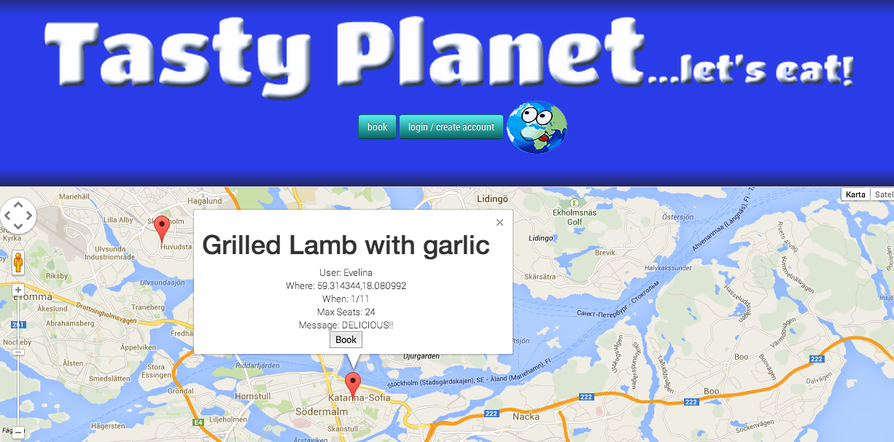

TastyPlanet
===========

TastyPlanet is a community for people passionate about sharing the flavors of life with friends new and old.  
We wanted to connect hungry eaters with generous home chefs, serving exciting home-cooked meals in your town and area. 

Live site available at http://www.tastyplanet.se/

The service is a Hyper Island Student Project, created by Digital Data Strategist '14 students Kelly Brofall, Dave Garfinkel & Anders Lundkvist, during Toolbox module. 

The project was possible through the aid of the following technologies: 
Code available on Github 
Responsive design through Bootstrap  
Locations shared on Google Maps 
Accounts stored on Firebase 
Embedded feed from Instagram 
Fonts called from Google Fonts 
...and more... 

Olive Cats, 2013
